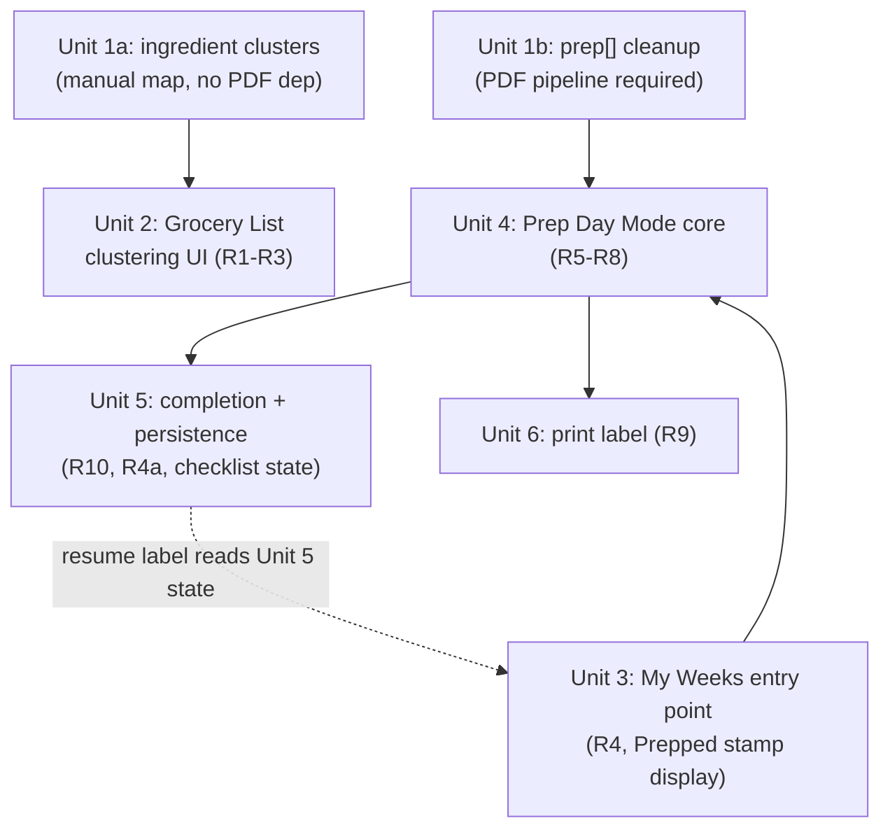

# Shopping & Prep Efficiency — Ingredient Grouping + Prep Day Mode

## Overview

Two connected additions to the single-file meal-planner app (`index.html`):

1. **Grocery List ingredient grouping** — cluster true same-ingredient form-variants (e.g. "frozen diced onion" vs. "yellow onion, diced") on the Grocery List tab, with an advisory consolidation tip.
2. **Prep Day Mode** — a new full-screen, guided, per-bag checklist flow for freezer-bag assembly, launched from My Weeks, with reserve-ingredient reminders, labeling steps, a printable bag label, and a "Prepped" completion stamp.

Both depend on a data-cleanup prerequisite, split into two independent passes: a small hand-authored ingredient-name cluster map (no external dependency) and a `prep[]` corruption fix that extends the existing `scripts/reconcile.cjs` PDF-reconciliation pipeline — per the origin document's explicit decision to fix data quality before building UI on top of it.

## Problem Frame

Household meal planning has four stages: review meals, select meals, buy groceries, prep freezer bags. The grocery and prep stages are currently the weakest: the same ingredient appears as unrelated line items in different forms across meals, and bag-assembly directions only exist one meal at a time inside the Meals tab's Recipe expander, with no checklist, no labeling support, and no progress tracking. Full detail in the origin document.

## Requirements Trace

- R1-R3: Grocery List ingredient-form clustering with an advisory tip (origin: R1-R3)
- R4, R4a: Prep Day Mode entry point with resume behavior (origin: R4, R4a)
- R5: Full-screen, per-bag sequential navigation with exit action (origin: R5)
- R6, R7: Per-bag ingredient checklist and reserve-item reminder (origin: R6, R7)
- R8: Bag-sealing/labeling checklist items from `prep[]` (origin: R8)
- R9: Printable bag label (name + use-by date only) (origin: R9)
- R10: Per-bag and per-week completion tracking, "Prepped" stamp (origin: R10)

## Scope Boundaries

Carried forward from the origin document — no cross-meal chop aggregation, no freezer inventory/consumption tracking, no auto-substitution of grocery items, no multi-device sync, no state-machine locking on a "Prepped" week. See origin document for full rationale.

### Deferred to Separate Tasks

- Any future "freezer inventory" view building on the R10 "Prepped" stamp — explicitly deferred in the origin document (idea #5, `docs/ideation/2026-07-19-meal-journey-ux-ideation.md`).

## Context & Research

### Relevant Code and Patterns

- `index.html:123-286` — `App()`: owns all top-level state (`tab`, `ratings`, `hidden`, `weeks`, `activeWeek`, `checked`, `shopWeeks`, `hidePantry`, `loaded`). Persists via `loadState()`/`saveState()` (`index.html:104-113`) to a single `localStorage` key `familydinner:v1`, with the persisted shape being exactly `{ ratings, hidden, weeks, checked, shopWeeks, hidePantry }` (`index.html:154`). Any new persisted state must be folded into that literal object.
- `index.html:232-282` — tab-switch conditional in `App`'s render, the pattern a new full-screen Prep Day Mode should extend (a new piece of state, e.g. `prepDayWeekId`, that when set causes `App` to render `PrepDayMode` instead of the normal tab body).
- `index.html:161` — `addWeek`: week shape is `{ id, name, items: [] }`. `index.html:175-189` — `addToWeek`/`setMult`: items are `{ rid, mult }`.
- `index.html:657-665` — the batch-multiplier buttons in `WeeksTab` actually offer **×1/×2/×3** (`[1, 2, 3].map(...)`), not just ×1/×2 as the origin document assumed. See Open Questions — this is a confirmed correction, and R5's "N batches → N sequential bag screens" design already generalizes cleanly to any of the three values.
- `index.html:615-621` (`.fd-weekactions`) — where a "Start/Resume Prep Day" button naturally sits, following the existing gating pattern used by the "Grocery list →" button (`disabled={week.items.length === 0}`, `index.html:617`).
- `index.html:611-632` (`.fd-weektitle`/`.fd-weekstats`) — where a "✓ Prepped `<date>`" stamp renders, following the existing `.fd-badge` (`index.html:225`, CSS `1001`) and `.fd-statchip` (CSS `1078`) visual conventions.
- `index.html:683-702` — `GroceryTab`'s `grouped` `useMemo`: builds `{ category -> { "name|unit"-lowercased -> { n, u, cat, qty, hasQty, count } } }` from every chosen week's `ing[]`, summing `q * mult`. Grouping key is a literal lowercase `name|unit` string — no canonical/fuzzy matching exists today. This is the exact gap R1-R3 fills, and per the origin document's Key Decision, the fix point is upstream data (a canonical cluster key baked into `ing[]` by a hand-authored map, see Unit 1a), not new runtime fuzzy-matching logic in this component.
- `index.html:711-714` — the `checked` checkbox-persistence pattern: a single flat object keyed `category + "::" + itemKey`. This is the pattern to mirror for Prep Day Mode's per-item checklist state — but as its own separate flat map (matching how `shopWeeks` is already separate from `checked`), not reusing `checked` itself.
- `index.html:859-904` (`.fd-copy-overlay`/`.fd-copy-panel`, CSS `1146-1147`) — the only existing modal-like UI (a centered dialog with backdrop). This is a *centered dialog*, not a full-screen takeover, so it is not a direct template for Prep Day Mode — it confirms there's no existing full-screen precedent to adapt, and a new render-mode approach (see above) is needed instead.
- `index.html:1138-1142`, `1185-1189` — the two existing `@media print` blocks (Grocery List, Instructions). Both hide chrome and print the *entire current tab's DOM*. Neither has a pattern for printing an isolated small element — confirmed no existing precedent for R9's bag label; it needs its own dedicated print-only subtree and `@media print` rule.
- `scripts/reconcile.cjs:1-163` — already has ingredient name/token matching machinery intended for exactly this kind of work: `norm`, `tokens`, `overlapScore`, `matchIng`, a module-level `ALIAS` map (line ~20), a `STOP` word list (line ~19), and a per-recipe `OVERRIDES` map keyed by recipe name (lines 71-80) as the escape hatch for cases heuristics can't resolve. `scripts/enrich.cjs` uses the same "regex heuristic + manual `OVERRIDES` map keyed by recipe id" convention independently (e.g. `r18`, `r33`). Both scripts read/write `index.html`'s `DATA` constant directly via `html.match(/const DATA = (\[.*?\]);\n/s)` / `html.replace(...)`, with `report` (print findings, no changes) and `apply` (write changes) modes — this report/apply convention is the established verification pattern in this repo, given there is no test framework.
- No `package.json` exists — scripts are run ad hoc via `node scripts/<name>.cjs <args>`, not wired as npm scripts. New script work should follow this same invocation style.

### Institutional Learnings

None — `docs/solutions/` does not exist in this repository yet. Planning is grounded directly in the codebase (above) and the origin document.

## Key Technical Decisions

- **Ingredient clustering is a manually-curated map, not an algorithm** (corrected from an earlier draft of this plan — see Risks): the earlier approach proposed token-overlap scoring with a similarity threshold and a manual exclude-list to guard against false merges (like green onion vs. yellow onion). Two review passes independently flagged this as backwards: `scripts/reconcile.cjs` already has a manually-curated `ALIAS` map (line ~20) for exactly this class of problem, and — critically — the plan already requires a human to review every candidate cluster by hand in `report` mode before `apply` regardless of which approach is used. If a human reviews every cluster anyway, a small hand-authored map of the known variant pairs (already enumerated in the origin document) delivers the same result with no false-merge risk and no threshold to tune. This also matches the origin document's own reasoning for rejecting *runtime* fuzzy-matching in the React component — the same argument applies to *offline* fuzzy-matching for this data, at this scale (198 names, one household). (origin: R1-R3, Key Decisions)
- **Ingredient clustering does not depend on the PDF pipeline** (see Risks — Unit 1's original approach coupled it to one): clustering only needs data already committed to `DATA` in `index.html`; it needs no PDF source text. It runs as a small, separate pass — either a new standalone script or an early-exit mode in `reconcile.cjs` that operates directly on `DATA` and never touches `recipes.json` — so it isn't blocked by the PDF-extraction prerequisite the `prep[]` cleanup pass requires (see below).
- **Cross-category duplicates are a data fix, not a UI feature**: the origin document flagged that some ingredient variants (e.g. a miscategorized green-onion entry) span store categories due to existing `ing[].c` data bugs, not genuine category differences. Rather than building cross-category cluster UI, clusters render within their existing store category, and any real miscategorization is corrected as part of the same cluster-map data-cleanup pass. This resolves the origin document's open question using the codebase's existing data-quality-fix pattern rather than adding UI complexity. (origin: Outstanding Questions, R1)
- **`prep[]` cleanup follows the same script + override-map convention already used twice in this codebase, but must target the freshly re-parsed PDF text, not `DATA`'s existing (corrupted) value**: verified `scripts/reconcile.cjs` line 154 does `r.prep = p.prep;` unconditionally in `apply` mode — every recipe's `prep[]` is fully replaced by what's freshly parsed from the source PDF text on that run, not mutated in place. The verified corruption already in `DATA` (34/56 meals, not 33 as first estimated — see Unit 1) came from exactly this assignment on a prior run, meaning the corruption's root cause is upstream, in how the "prep/freezer directions" text block gets extracted. A cleanup heuristic written against `DATA`'s current `prep[]` would have zero effect once `apply` runs and overwrites it with `p.prep` again. The heuristic must instead be applied to `p.prep` (or inserted between parsing and the `r.prep` assignment), following the same bounded-heuristic-plus-`OVERRIDES` convention `reconcile.cjs` and `enrich.cjs` already use elsewhere, so the fix survives every future re-run of this pipeline. (origin: R8, Dependencies)
- **The `prep[]` cleanup pass requires standing up a PDF-extraction prerequisite that does not currently exist in this repo**: `scripts/reconcile.cjs` reads `<dir>/recipes.json` at load time (line ~16), which is produced by `node scripts/parse_pdfs.cjs <dir> json`, which itself requires a directory of `Month N....txt` files. Per this script's own header comment, those `.txt` files are extracted from the source PDFs via `pypdf` (Python) — a step with no script committed to this repo and no dependency declaration, previously run ad hoc in a scratchpad that no longer exists. Neither `recipes.json` nor any extracted `.txt` files exist in the repo today; the source PDFs themselves live outside the repo entirely. This is a real prerequisite step, not an implementation detail — see Unit 1's explicit prerequisite steps below.
- **Prep Day Mode is a new top-level render mode in `App`, not a modal**: the only existing modal-like UI (`.fd-copy-overlay`) is a centered dialog, not a full-screen takeover, and doesn't fit R4/R5's full-screen, chrome-hidden requirement. A new piece of `App` state, `prepDayWeekId`, causes `App` to render a new `PrepDayMode` component in place of the normal tab body — extending the existing tab-switch conditional pattern (`index.html:232-282`) rather than introducing a second UI paradigm.
- **Per-item checklist state is a new, separate flat map in the persisted state object**, named `prepProgress` and keyed `weekId::rid::bagInstanceIndex::itemIndex`. This uses the same `::`-delimited string-key *convention* as `checked` (`category::item`), but is a structurally different, four-part key, not a mirror of `checked`'s exact two-part shape — kept as its own map (matching how `shopWeeks` is already independent from `checked`) so Prep Day Mode and Grocery List state can never collide. This directly resolves the origin document's flagged risk that `(weekId, rid)` alone would collide between bag 1 and bag 2 of a ×2+ batch meal. Note the tradeoff this accepts: keying by array position means a future data-pipeline run that reorders or resizes a meal's `ing[]`/`prep[]` could misalign a user's already-persisted checkmarks with no automatic detection — accepted as a known limitation (see Risks) given this app's single-household scale, rather than building index-stabilization machinery the origin document never asked for.
- **Verification is manual/browser-based, not automated tests**: this repo has no test framework, no `package.json`, and no build step by deliberate design (a static, no-build single-file app). The existing verification convention for the Node scripts is their own `report` mode (print findings without changing anything); the existing verification convention for the UI (used throughout this project's actual development) is manual checks in a browser. This plan follows both conventions rather than introducing a test framework as new project infrastructure the origin document never asked for.
- **Batch count generalizes to ×1/×2/×3, correcting the origin document's assumption**: verified the My Weeks batch buttons (`index.html:657-665`) offer `[1, 2, 3]`, not just ×1/×2. R5's "N batches → N sequential bag screens" design already generalizes without change; only the origin document's stated Dependency ("mult is always... ×1/×2 today") needed correcting.

## Open Questions

### Resolved During Planning

- Normalization approach for R1-R3 (origin: [Needs research]): resolved above — a small, manually-curated cluster map (following the existing `ALIAS`-map convention), not an algorithm, assigning each ingredient a canonical `cluster` key consumed as a lookup by `GroceryTab`.
- Store-category-crossing risk for R1 (origin: [Technical]): resolved above — clusters stay within their existing category; miscategorized entries get fixed as data, not accommodated in the UI.
- Bag-instance state keying for R5-R10 (origin: [Technical]): resolved above — a new `prepProgress` map keyed `weekId::rid::bagInstanceIndex::itemIndex`, separate from `checked`.
- `prep[]` cleanup approach for R8 (origin: [Technical]): resolved above — a heuristic + `OVERRIDES` pass applied to the freshly re-parsed PDF text (`p.prep`, not `DATA`'s existing value), following the codebase's own established convention, rather than a display-time truncation rule in the React component.
- Batch-count range (new, found during research): corrected to ×1/×2/×3 (verified against `index.html:657`), not ×1/×2 as the origin document assumed. No design change needed — R5 already generalizes.
- Prep Day Mode bag navigation (new, found during plan review): resolved below (Unit 4) — Next/Previous is never gated on checklist completion; checking items is voluntary progress tracking, matching how the existing Grocery List checkboxes already work (nothing in this app currently forces completion before moving on).
- "Prepped" stamp behavior when a week is edited after completion (new, found during plan review): resolved below (Unit 5) — the stamp and any existing checkmarks persist as-is; editing a Prepped week's meals does not auto-clear or auto-reconcile them (consistent with the origin document's explicit "no state-machine locking" scope boundary).
- Use-by date computation (new, found during plan review): resolved below (Unit 6) — calendar-month arithmetic (today's date, month field +3, with end-of-month clamping if the target month is shorter), not a fixed 90/91-day offset.

### Deferred to Implementation

- Exact print-label CSS layout/sizing (origin: [Technical], R9) — depends on seeing the label rendered; the architectural direction (a dedicated print-only subtree with its own `@media print` rule, distinct from the two existing whole-tab print blocks) is set, but pixel/inch dimensions are an implementation-time call.
- Exact heuristic rules for truncating corrupted `prep[]` trailing text — depends on running the heuristic against all 56 meals and inspecting which ones need a manual `OVERRIDES` entry, the same iterative process already used for the prior `ing[]`/`reserve[]` cleanup pass.
- Whether to use the Screen Wake Lock API (or an equivalent) to keep the display on during a Prep Day session — genuinely useful for a hands-busy kitchen-counter flow, but a real browser-API/permission-surface tradeoff (support varies, adds a dependency) that the origin document never asked for. Left for implementation to decide whether it's worth the added surface, rather than assumed here.

## High-Level Technical Design

> This illustrates the intended approach and is directional guidance for review, not implementation specification. The implementing agent should treat it as context, not code to reproduce.



App render-mode sketch for Prep Day Mode (illustrative only):

```
App state: prepDayWeekId | null

render:
  if prepDayWeekId is set:
    render <PrepDayMode week=... onExit={() => setPrepDayWeekId(null)} />
  else:
    render existing tab switch (Meals / My Weeks / Grocery List / Instructions)
```

## Implementation Units

- [x] **Unit 1a: Data-cleanup prerequisite — ingredient clustering (manually-curated, no PDF dependency)**

**Goal:** Give every `ing[]` entry in `DATA` a canonical `cluster` key for true same-ingredient form-variants, using a small hand-authored map — not an algorithm — so `GroceryTab` can group by simple lookup.

**Requirements:** R1-R3 (data prerequisite)

**Dependencies:** None. Deliberately does not depend on the PDF-extraction pipeline (see Unit 1b) — this pass only reads/writes `DATA`, which is already committed to `index.html`.

**Files:**
- Create or modify: a small script (either a new file, e.g. `scripts/cluster_ingredients.cjs`, or an early-exit mode added to `scripts/reconcile.cjs` that returns before the `recipes.json` read) — implementation should pick whichever keeps the PDF-dependent and PDF-independent passes clearly separated.
- Modify: `index.html` (only the `DATA` constant, rewritten by this pass — no other manual edits)

**Approach:**
- Hand-author a small map of canonical ingredient names to their known form-variant `n` values across the 56 meals (e.g. the onion example from the origin document, plus any others found by scanning the known 198 unique `ing[].n` values), following the exact spirit of `scripts/reconcile.cjs`'s existing `ALIAS` map — a short, explicit, human-reviewed list rather than a similarity-scoring algorithm. This removes the false-merge risk entirely (no green-onion/yellow-onion mistake is possible from a hand-written map) rather than mitigating it with a guard list.
- For each `ing[]` entry whose `n` appears in the map, write the map's canonical cluster key onto that entry as a new field, `cluster`.
- Have a `report` mode (print the resulting clusters, change nothing) reviewed by hand before an `apply` mode writes `DATA` — same script-hygiene convention as `reconcile.cjs`, even though this pass doesn't share its PDF dependency.

**Patterns to follow:**
- `scripts/reconcile.cjs`'s `ALIAS` map (line ~20) as the direct precedent for a small, hand-curated name-variant list.
- `scripts/reconcile.cjs`'s `report`/`apply` mode split for how changes are staged and reviewed before being written to `index.html`.

**Test scenarios:**
- Happy path — report mode: running the clustering pass in report mode assigns "frozen diced onion" and "yellow onion, diced" (true form-variants, per the hand-authored map) the same `cluster` key.
- Edge case — no accidental merges: because the map is hand-authored rather than similarity-scored, green onion and yellow onion simply never appear together in any map entry — verify this by inspecting the map itself, not by testing an algorithm's output.
- Integration — apply mode: after applying, `index.html`'s `DATA` constant parses as valid JSON, every one of the 56 meals still has a non-empty `ing[]` array, and only entries present in the hand-authored map carry a `cluster` field (everything else is untouched).

**Verification:**
- `report` mode output matches the hand-authored map exactly, reviewed by hand.
- `apply` mode's rewritten `DATA` loads correctly when `index.html` is opened in a browser (existing meals/cards still render — see Unit 2 for the feature that consumes the new field).

---

- [x] **Unit 1b: Data-cleanup prerequisite — `prep[]` repair via the PDF-extraction pipeline**

**Goal:** Fix the verified `prep[]` corruption (34 of 56 meals have leaked recipe-card text in their final entry) by extending `scripts/reconcile.cjs`'s PDF-reconciliation pass — applied to the freshly parsed PDF text, not to `DATA`'s already-corrupted value.

**Requirements:** R8 (data prerequisite)

**Dependencies:** None on Unit 1a. Requires standing up a PDF-extraction prerequisite this repo does not currently have committed (see below) before the script can run at all.

**Files:**
- Modify: `scripts/reconcile.cjs`
- Modify: `index.html` (only the `DATA` constant, rewritten by the script's `apply` mode)

**Approach:**
- **Prerequisite (must happen before this unit's code changes, and every time this pipeline is re-run in the future):** `scripts/reconcile.cjs` reads `<dir>/recipes.json` at load time, which does not exist in this repo. It's produced by `node scripts/parse_pdfs.cjs <dir> json`, which itself requires a directory of `Month N....txt` files extracted from the source PDFs via `pypdf` (Python) — confirmed no script or dependency for this extraction step exists in the repo today. Before this unit's code can run: (1) confirm the source PDFs are available (previously found under a Downloads folder outside the repo), (2) extract their text via `pypdf` into a working directory, (3) run `node scripts/parse_pdfs.cjs <dir> json` and confirm its output reports "missing: none" for all 56 meals, (4) only then proceed to `reconcile.cjs`.
- Add a `prep[]` cleanup step to the reconciliation pass, applied to `p.prep` (the value parsed fresh from PDF text) **before** the existing `r.prep = p.prep` assignment — not applied to `DATA`'s current `prep[]`, which gets unconditionally overwritten by that assignment on every `apply` run regardless of what cleanup was done to it previously. A bounded heuristic truncates known corruption markers (e.g. text starting with "MEAL PLAN #" or the recipe-card disclaimer sentence) from the parsed trailing entry; anything the heuristic can't confidently resolve goes into a per-recipe `OVERRIDES` entry, following the exact convention `reconcile.cjs` and `scripts/enrich.cjs` already use elsewhere. The heuristic + overrides together must resolve all 34 known-corrupted meals — not just establish the mechanism — verified by hand against `report` mode output before `apply`.

**Patterns to follow:**
- `scripts/reconcile.cjs`'s existing `OVERRIDES` map (lines 71-80) and `report`/`apply` mode split.
- `scripts/enrich.cjs`'s `OVERRIDES` keyed by recipe id (`r18`, `r33`, etc.) as a second precedent for the same convention.

**Test scenarios:**
- Happy path — report mode: running `node scripts/reconcile.cjs <dir> report` (after the PDF-extraction prerequisite is satisfied) shows a known corrupted entry (e.g. the "MEAL PLAN #7 *This recipe card..." case cited in the origin document) truncated to just its real content in the *proposed* `p.prep` output.
- Edge case — survives future re-runs: because the cleanup targets `p.prep` and runs before the `r.prep = p.prep` assignment, re-running the full pipeline again (as the Risks table anticipates might happen) reproduces the same clean result rather than reintroducing the corruption.
- Integration — apply mode: after `node scripts/reconcile.cjs <dir> apply`, all 56 meals have a non-empty `prep[]` array, and all 34 previously-corrupted meals no longer contain a "MEAL PLAN #" or recipe-card-disclaimer fragment.

**Verification:**
- `report` mode output shows all 34 known corruptions resolved, with no unintended content loss, reviewed by hand against the full 56-meal `prep[]` set.
- `apply` mode's rewritten `DATA` loads correctly when `index.html` is opened in a browser — see Unit 4 for the feature that consumes the cleaned field.

---

- [x] **Unit 2: Grocery List — ingredient-form clustering UI (R1-R3)**

**Goal:** Group ingredient line items sharing a `cluster` key under one heading on the Grocery List tab, with an advisory consolidation tip.

**Requirements:** R1, R2, R3

**Dependencies:** Unit 1a (needs the `cluster` field in `DATA`)

**Files:**
- Modify: `index.html` (`GroceryTab`, `index.html:680-907`)

**Approach:**
- Extend the `grouped` `useMemo` (`index.html:683-702`) to additionally group by `cluster` within each store category, alongside the existing per-item grouping — items with the same `cluster` key render under a shared sub-heading showing which meals need each form and in what quantity (R2). The heading's display text is the hand-authored map's designated canonical name for that cluster (set explicitly in Unit 1a's map, not derived at render time), so it never depends on which meal happens to appear first.
- When a cluster contains both a frozen and a non-frozen (fresh) form of the same ingredient — the one bounded case R3 actually asks for, per the origin document — render a small advisory tip beneath the cluster heading, e.g. *"Buying fresh and chopping covers all forms above."* No other trigger condition shows a tip; this keeps R3 informational-only and unambiguous rather than an open-ended "obvious simplification" judgment call.
- No change to the existing `checked` checkbox behavior — clustering is a display grouping, individual line items remain individually checkable exactly as today.

**Patterns to follow:**
- Existing `grouped` `useMemo` structure and category rendering in `GroceryTab`.
- Existing `.fd-badge`/tip-style visual conventions elsewhere in the CSS (`index.html:987-1190`) for the advisory tip's styling.

**Test scenarios:**
- Happy path — cluster rendering: two ingredient lines sharing a `cluster` key (from Unit 1a's onion example) render grouped under one heading within their shared store category, each still showing its own meal/quantity detail (R2).
- Happy path — advisory tip: a cluster with a fresh/frozen consolidation opportunity shows the tip text; the underlying grocery list items are unchanged (still individually present and checkable) (R3).
- Edge case — no cluster: an ingredient with no `cluster` match (most of the 198 names) renders exactly as it does today, unaffected by this change.
- Edge case — single-item cluster: a `cluster` key matching only one `ing[]` entry across all selected weeks renders as a normal single line, not as a labeled "cluster" with one item.
- Integration — checkbox persistence: checking off an item inside a cluster still persists via the existing `checked` state exactly as before (clustering doesn't change the checkbox key or behavior).

**Verification:**
- Manually verify in-browser: select weeks containing the known onion-variant example from Unit 1a, confirm the cluster heading, per-form breakdown, and tip render correctly, and that checking items off still works and persists across a reload.

---

- [x] **Unit 3: My Weeks — Prep Day entry point and "Prepped" stamp display**

**Goal:** Add the "Start Prep Day" / "Resume Prep Day" action to a week, and render its "Prepped" completion stamp once available.

**Requirements:** R4 (entry point only — R4a's resume-label logic and R10's completion detection are Unit 5's, read here for display)

**Dependencies:** None for the basic "Start Prep Day" entry point itself (R4). The "Resume Prep Day" label (R4a) and "✓ Prepped" stamp (R10) are display-only reads of state that Unit 5 creates — build the button/stamp UI here, but its R4a/R10 behavior isn't testable end-to-end until Unit 5 lands (see Unit 5).

**Files:**
- Modify: `index.html` (`WeeksTab`, `index.html:561-677`; `App`, `index.html:123-286` for the new `prepDayWeekId` state)

**Approach:**
- Add a "Start Prep Day" button to `.fd-weekactions` (`index.html:615-621`), gated on `week.items.length > 0` like the existing "Grocery list →" button.
- Add a "✓ Prepped `<date>`" stamp near `.fd-weektitle`/`.fd-weekstats`, and a "Resume Prep Day" label swap, both driven by reading Unit 5's `prepProgress` state — this component only renders what Unit 5 computes, it does not compute completion/resume logic itself.
- Clicking the action sets `App`'s new `prepDayWeekId` state, triggering the Unit 4 render-mode switch.

**Patterns to follow:**
- Existing `.fd-weekactions` button and `disabled` gating pattern (`index.html:617`).
- Existing `.fd-badge` (`index.html:225`) and `.fd-statchip` (CSS `1078`) visual patterns for the Prepped stamp.

**Test scenarios:**
- Happy path — entry: a week with meals shows an enabled "Start Prep Day" button; clicking it sets `prepDayWeekId` and the app switches to Prep Day Mode.
- Edge case — empty week: a week with no meals has the action disabled, matching the existing "Grocery list →" gating.
- Happy path — resume label: a week with partial bag-checklist progress (from a prior session) shows "Resume Prep Day" instead of "Start Prep Day".
- Happy path — Prepped stamp: a week whose completion state is fully checked off shows the "✓ Prepped `<date>`" stamp.
- Integration — stamp does not block editing: a "Prepped" week's meals/mult remain editable exactly as before (Scope Boundaries: no state-machine locking).

**Verification:**
- Manually verify in-browser: create a week, confirm the button/gating states across empty, in-progress, and fully-prepped weeks, and confirm meal editing remains available on a Prepped week.

---

- [x] **Unit 4: Prep Day Mode — full-screen bag-sequencing shell and per-bag checklist (R5, R6, R7, R8)**

**Goal:** Build the new `PrepDayMode` component: full-screen, sequential per-bag navigation, ingredient checklist, reserve-item reminder, and sealing/labeling steps.

**Requirements:** R5, R6, R7, R8

**Dependencies:** Unit 1b (needs cleaned `prep[]` data), Unit 3 (entry point sets `prepDayWeekId`)

**Files:**
- Modify: `index.html` (add `PrepDayMode` component; wire the new render-mode conditional into `App`, `index.html:232-282`)

**Approach:**
- `App` conditionally renders `PrepDayMode` in place of the normal tab body when `prepDayWeekId` is set, hiding the tab bar/nav chrome for a true full-screen takeover (per the High-Level Technical Design sketch above).
- Expand the week's `items[]` into a flat, ordered list of bag instances — one entry per unit of `mult` (a ×3 meal produces 3 sequential bag entries), consistent with the corrected ×1/×2/×3 range from Key Technical Decisions.
- On entry, show a brief landing screen before Bag 1 — the week's name and total bag count (e.g. "Ready to prep 7 bags for Week of Jul 20") with a "Start"/"Resume" action — so the user knows the scope of the session before committing, given the kitchen-counter context R4 already calls out.
- Each bag screen shows: a checklist of that meal's `ing[]` minus `reserve[]` (R6); a visually distinct "do NOT bag" list of `reserve[]` items (R7); and the meal's cleaned `prep[]` sealing/labeling lines as additional checklist items (R8). Next/previous navigation and a "Bag N of M" indicator, plus an explicit close/exit action returning to My Weeks (R5).
- Next/Previous navigation is never gated on checklist completion — a user can move between bags freely regardless of how many items are checked, matching how the existing Grocery List checkboxes are voluntary tracking, not a completion gate. After the last bag, a simple "All bags done" confirmation screen offers a "Finish" action back to My Weeks (which is also where Unit 5's completion state gets its final read, driving the R10 stamp).
- Large tap targets throughout, per the origin document's kitchen-counter-use requirement (R4).

**Technical design:** *(directional only — see High-Level Technical Design above for the render-mode sketch.)*

**Patterns to follow:**
- Existing tab-switch conditional structure in `App` (`index.html:232-282`) for how the new render mode plugs in.
- Existing `reserve[]` "don't bag" rendering already used in `MealCard`'s Recipe expander (`index.html:432-441`) for consistent visual treatment of reserve items.

**Test scenarios:**
- Happy path — single-batch meal: a ×1 meal produces exactly one bag screen showing its `ing[]` minus `reserve[]`, its `reserve[]` list, and its `prep[]` labeling steps.
- Happy path — multi-batch meal: a ×3 meal produces three sequential, identically-populated bag screens (e.g. "Bag 2 of 5 — <meal> (2 of 3)"), not one screen with tripled quantities.
- Edge case — no reserve items: a meal with an empty `reserve[]` renders its bag screen without a "do NOT bag" section (or an empty-state that doesn't look broken).
- Edge case — first/last bag: "previous" is disabled/absent on the first bag; "next" from the last bag shows the "All bags done" confirmation screen, not a nonexistent bag.
- Edge case — navigation is not gated: moving to the next bag with zero items checked on the current bag succeeds without warning or blocking (checklist completion never gates navigation).
- Integration — exit path: the close/exit action (from any bag screen, or from the landing/confirmation screens) returns to My Weeks with the week's state (mult, meals) unchanged, regardless of checklist progress.

**Verification:**
- Manually verify in-browser: start Prep Day on a week containing both a ×1 and a ×3 meal, step through every bag screen, confirm ingredient/reserve/prep content matches the source recipe data, and confirm the exit action returns cleanly to My Weeks.

---

- [x] **Unit 5: Prep Day Mode — checklist persistence and completion detection (R10)**

**Goal:** Persist per-item checklist state across reloads, detect when a bag/week is fully checked off, and drive the R4a resume label and R10 "Prepped" stamp from Unit 3.

**Requirements:** R10, R4a (state that Unit 3 reads)

**Dependencies:** Unit 4 (needs the bag/checklist UI to attach state to)

**Files:**
- Modify: `index.html` (`App` state/`loadState`/`saveState`, `index.html:102-155`; `PrepDayMode` from Unit 4)

**Approach:**
- Add a new flat map, `prepProgress`, to the persisted state object (alongside `checked`/`shopWeeks`), keyed `weekId::rid::bagInstanceIndex::itemIndex`, tracking each checklist item's checked state — using the same `::`-delimited convention as `checked`, as its own separate map (see Key Technical Decisions for why this isn't a structural mirror of `checked`'s two-part key).
- "Fully checked off" for a bag means every item in both its R6 ingredient checklist and R8 labeling-steps checklist is checked (per the origin document's explicit R10 resolution). "Fully checked off" for a week means every expanded bag instance meets that bar.
- Derive the "Resume Prep Day" label (R4a) from whether any checked-but-incomplete state exists for a week, and the "Prepped `<date>`" stamp from full completion — both read by Unit 3's `WeeksTab` rendering.
- **Explicit behavior when a Prepped week is edited afterward**: the "Prepped `<date>`" stamp and all existing `prepProgress` checkmarks persist as-is — editing a week's meals or `mult` after it's been marked Prepped does not clear the stamp, does not reset checkmarks, and does not attempt to re-validate them against the edited meal list. This is a deliberate consequence of the origin document's "no state-machine locking" scope boundary, not an oversight: the stamp becomes a simple historical record ("this was prepped as of this date") rather than a live-synced completion indicator once the underlying week changes.

**Patterns to follow:**
- Existing `checked` state shape and the `toggle(c, k)` update pattern (`index.html:711-714`).
- Existing `loadState`/`saveState` wrapping (`index.html:104-113`) for the new persisted field.

**Test scenarios:**
- Happy path — persistence: checking an item in Prep Day Mode, reloading the page, and reopening the same week's Prep Day session shows the same item still checked.
- Happy path — completion: checking every item across every bag in a week (ingredients + labeling steps) triggers the "Prepped" state read by Unit 3.
- Edge case — bag-instance isolation: for a ×3 meal, checking an item in bag instance 1 does not check the corresponding item in bag instances 2 or 3 (verifies the `bagInstanceIndex` keying prevents collision).
- Edge case — partial completion: a week with some but not all items checked shows "Resume Prep Day" (R4a), not "Prepped".
- Integration — week edit after prepping: changing a meal's `mult` or removing a meal from an already-Prepped week does not crash the app; the plan does not require the stamp/progress to auto-reconcile against the edit (per the origin document, this is explicitly out of scope — verify only that it fails gracefully, not that it stays perfectly in sync).

**Verification:**
- Manually verify in-browser: complete a full Prep Day session for a week with a mixed ×1/×3 meal set, reload, confirm "Prepped" stamp and persisted checkmarks; partially complete a second week, reload, confirm "Resume Prep Day" reopens on the first unfinished bag with prior progress intact.

---

- [x] **Unit 6: Prep Day Mode — printable bag label (R9)**

**Goal:** Add a "Print label" action on each bag screen producing a small printable label (meal name + use-by date only).

**Requirements:** R9

**Dependencies:** Unit 4 (bag screen to attach the action to)

**Files:**
- Modify: `index.html` (`PrepDayMode` from Unit 4; new `@media print` rule near the existing two, `index.html:1138-1142`/`1185-1189`)

**Approach:**
- Compute the use-by date at print time as today's date with the month field advanced by 3 (standard calendar-month arithmetic, e.g. July 20 → October 20), clamped to the last valid day of the target month if it would otherwise overflow (e.g. Jan 31 → Apr 30, not Apr 31/May 1) — verified in the origin document to match the source PDFs' own stated freezer duration for every meal, so no per-meal variation is needed.
- Render a small, normally-hidden print-only subtree (e.g. `.fd-label-print`) containing just the meal name and use-by date. A dedicated `@media print` rule shows only that subtree and hides everything else (including normal Prep Day Mode chrome) when the "Print label" action triggers `window.print()` — distinct from the two existing whole-tab print blocks, which hide chrome but print the rest of the current tab's content.
- If the user cancels the browser's print dialog, nothing else needs to happen — `window.print()` is fire-and-forget and the app's state is unaffected either way, matching how the two existing print buttons already behave with no special cancel-handling.

**Patterns to follow:**
- Existing `@media print` block structure (`index.html:1138-1142`, `1185-1189`) for how print-mode CSS is scoped in this file, adapted to target only the new label subtree instead of a whole tab.

**Test scenarios:**
- Happy path — label content: triggering "Print label" on a given bag shows a print preview containing only that meal's name and a use-by date of today + 3 months.
- Edge case — multi-batch meals: printing a label from bag instance 2 of a ×3 meal shows the same meal name (no "(2 of 3)" batch-instance detail is required on the label itself, since the label only needs name + date per R9).
- Integration — no interference with existing print flows: triggering "Print label" does not alter or break the existing Grocery List "Print"/Instructions "Print week" behavior (separate, independently scoped `@media print` rules).

**Verification:**
- Manually verify in-browser print preview (or PDF export) that the label shows only meal name and the correct computed use-by date, and that the existing Grocery List/Instructions print buttons still produce their normal full-tab output unaffected.

## System-Wide Impact

- **Interaction graph:** All new state (ingredient `cluster` field, `prep[]` cleanup, `prepProgress`-style map, `prepDayWeekId`) is additive to existing structures (`DATA`, the persisted `familydinner:v1` object, `App` state) — no existing field is renamed or removed.
- **State lifecycle risks:** The new per-item checklist map grows with usage (one entry per checked item, indefinitely, matching how `checked` already behaves with no cleanup). Not a practical concern at this app's scale (56 meals, single household), consistent with the origin document's existing acceptance of the same tradeoff for `checked`.
- **API surface parity:** N/A — no API layer exists.
- **Integration coverage:** The manual verification steps under Units 4-5 specifically exercise the ×3-batch case (bag-instance isolation, sequential screens) since that's the scenario most likely to reveal a keying or expansion bug that per-unit checks alone might miss.
- **Unchanged invariants:** The Meals tab's Recipe expander (existing `reserve[]`/`prep[]`/cook-steps display) is untouched and remains the fallback detail view; Instructions tab and its cook-day steps are untouched; existing Grocery List checkbox behavior for non-clustered items is unchanged; `scripts/parse_pdfs.cjs` and `scripts/enrich.cjs` are unmodified (only `reconcile.cjs` is extended, consistent with it already being the reconciliation-stage script in the existing three-stage pipeline).

## Risks & Dependencies

| Risk | Mitigation |
|------|------------|
| **(Corrected from an earlier draft of this plan)** The original Unit 1 approach proposed a token-overlap clustering algorithm coupled to `scripts/reconcile.cjs`, which crashes without a `recipes.json` this repo doesn't have, and added false-merge risk an algorithm doesn't need to carry | Split into Unit 1a (hand-authored cluster map, no PDF dependency, no false-merge risk by construction) and Unit 1b (PDF-dependent `prep[]` cleanup only, with its prerequisite steps made explicit) |
| The `prep[]` cleanup pipeline (Unit 1b) requires a PDF-extraction step (`pypdf`/Python) that has no script or dependency declaration committed to this repo | Unit 1b's Approach spells out the exact prerequisite steps required before `reconcile.cjs` can run; treat this as a one-time setup cost to document (e.g. a future `docs/solutions/` entry) once completed |
| `prep[]` cleanup heuristic targets the wrong side of `reconcile.cjs`'s `r.prep = p.prep` assignment and silently has no effect | Unit 1b explicitly applies the heuristic to `p.prep` before that assignment, with a test scenario verifying the fix survives a repeat pipeline run |
| `prep[]` truncation heuristic cuts real content, not just corruption | `report`-before-`apply` review process, plus the established `OVERRIDES` escape hatch for meals the heuristic gets wrong; must resolve all 34 known-corrupted meals, not just establish the mechanism |
| New full-screen render mode introduces a dead end (no way back to the app) if the exit action is missed during implementation | Explicit exit-action requirement in R5 and a dedicated integration test scenario in Unit 4 |
| Bag-instance state collisions for ×2/×3 batch meals if keying is implemented incorrectly | Explicit `bagInstanceIndex` in the state key (Key Technical Decisions) and a dedicated isolation test scenario in Unit 5 |
| `prepProgress`'s array-position-based keying (`bagInstanceIndex::itemIndex`) could silently misalign with a user's existing checkmarks if a future data-pipeline run reorders or resizes a meal's `ing[]`/`prep[]` | Accepted as a known limitation given this app's single-household scale, consistent with the origin document's existing acceptance of the same no-auto-reconciliation tradeoff for edited Prepped weeks — documented here rather than building index-stabilization machinery nobody asked for |
| No automated test suite means regressions rely on manual verification | Each unit's manual verification steps are specific enough to re-run consistently; consider a future `docs/solutions/` entry documenting this project's manual-verification convention once this feature ships |

## Sources & References

- **Origin document:** [docs/brainstorms/2026-07-19-shopping-prep-efficiency-requirements.md](../brainstorms/2026-07-19-shopping-prep-efficiency-requirements.md)
- Related code: `index.html`, `scripts/reconcile.cjs`, `scripts/enrich.cjs`, `scripts/parse_pdfs.cjs`
- Related docs: `docs/ideation/2026-07-19-meal-journey-ux-ideation.md` (idea #5, explicitly deferred)
